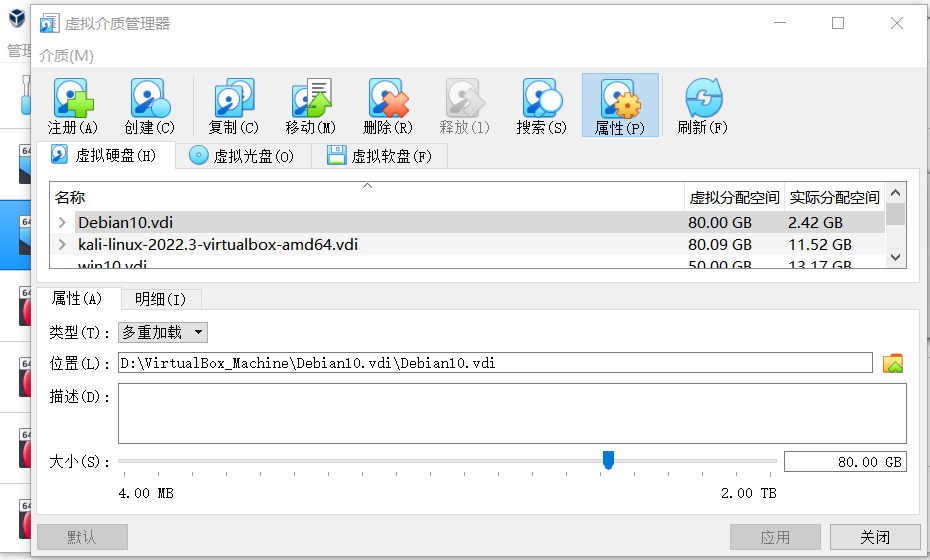
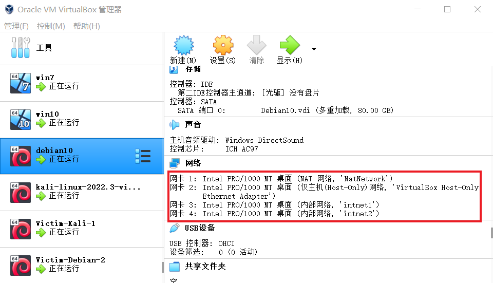
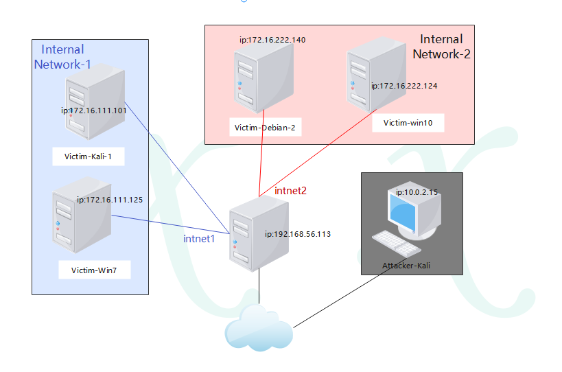
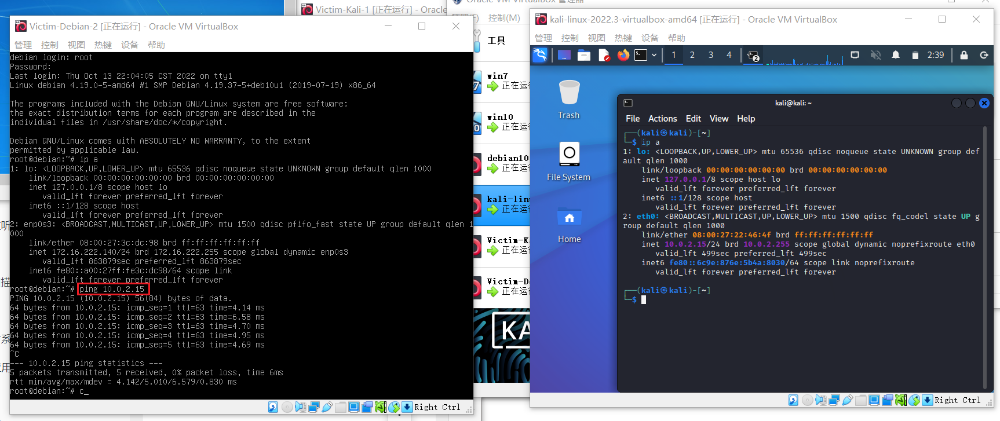
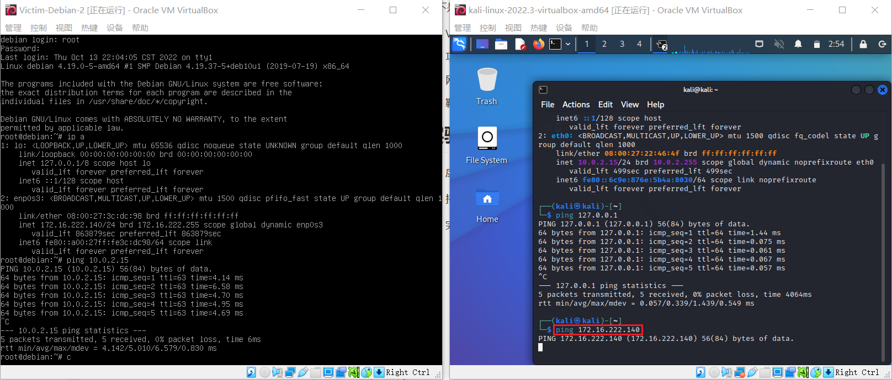
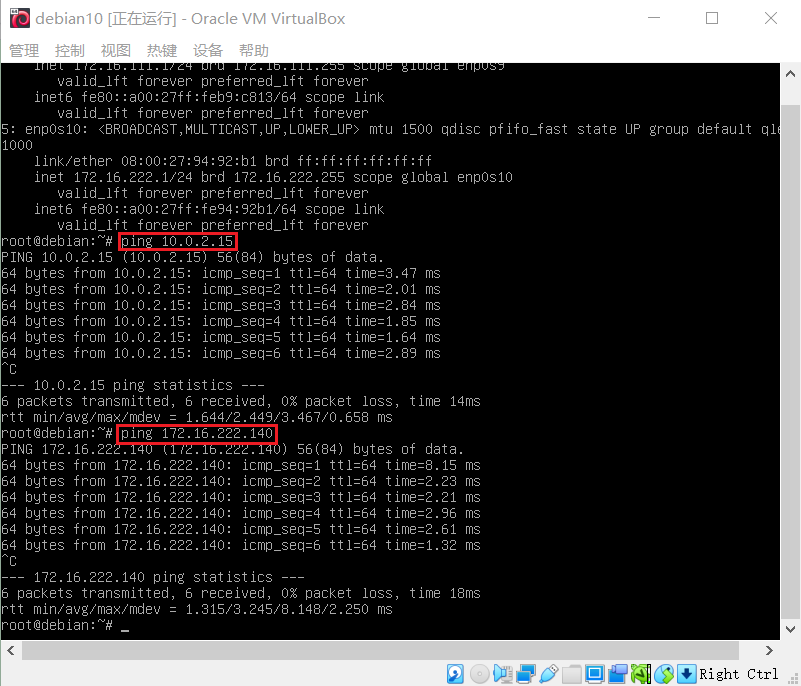
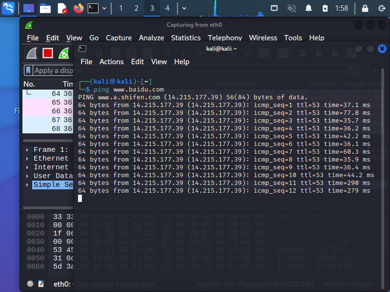
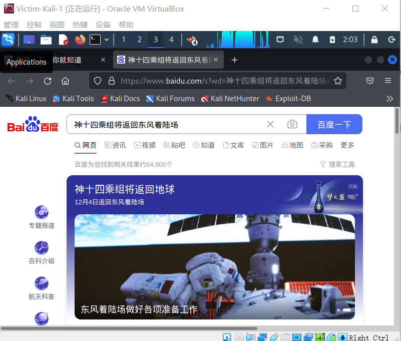
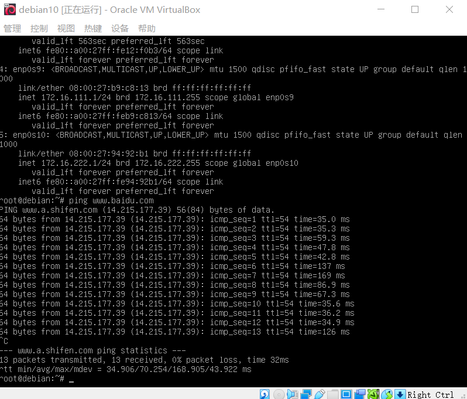

# 基于 VirtualBox 的网络攻防基础环境搭建

## 实验目的

- 掌握 VirtualBox 虚拟机的安装与使用；
- 掌握 VirtualBox 的虚拟网络类型和按需配置；
- 掌握 VirtualBox 的虚拟硬盘多重加载；

## 实验环境

以下是本次实验需要使用的网络节点说明和主要软件举例：

- VirtualBox 虚拟机
- 攻击者主机（Attacker）：Kali Rolling 2019.2
- 网关（Gateway, GW）：Debian Buster
- 靶机（Victim）：win7 / Debian / Kali

## 实验要求

- 虚拟硬盘配置成多重加载，效果如下图所示；


- 搭建满足如下拓扑图所示的虚拟机网络拓扑；


> 根据实验宿主机的性能条件，可以适度精简靶机数量

- 完成以下网络连通性测试；
  - [x] 靶机可以直接访问攻击者主机
  - [x] 攻击者主机无法直接访问靶机
  - [x] 网关可以直接访问攻击者主机和靶机
  - [x] 靶机的所有对外上下行流量必须经过网关
  - [x] 所有节点均可以访问互联网

## 实验过程

1. 配置虚拟硬盘多重加载

2. 搭建虚拟机网络拓扑

   网关所需网卡：NAT网络（为了使网关可以访问攻击者主机），Host-only网络（可以进行网卡的设置），两块内部网络（分别用于搭建两块独立的局域网）


   攻击者所需网卡：NAT网络，两块不同的Host-only网络

   victim（被攻击者）所需网卡：均为内部网络，使其分为两组，分别在不同的局域网内

3. 完成网络连通性测试

- 靶机可以直接访问攻击者主机

- 攻击者主机无法直接访问靶机

- 网关可以直接访问攻击者主机和靶机

- 靶机的所有对外上下行流量必须经过网关

   在靶机进行上互联网时，用网关进行抓包，如果靶机发出去的所有包都能被网关抓到，则说明靶机的所有对外上下行流量必须经过网关 

- 所有节点均可以访问互联网




## 问题
debian系统中ifconfig以及arp等等命令均无法找到命令，输入下面命令进行配置上网工具以后解决了问题

 ```shell
 apt install net-tools
 ```

## 参考文献
[基于virtualbox的网络攻防基础环境搭建](https://blog.csdn.net/lemonalla/article/details/105592150)