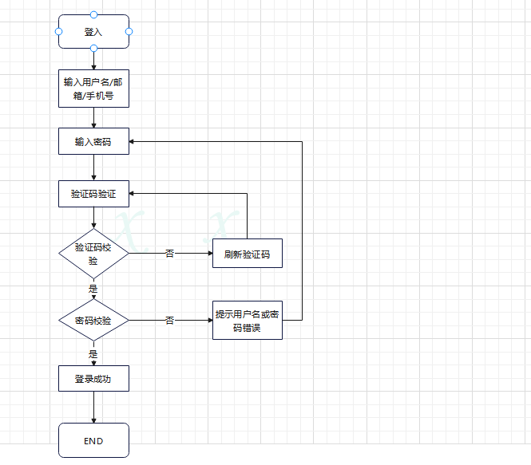

# 操作系统的访问控制设计实例

## 实验目的

- 以 iOS 和 Android 系统为研究对象，对操作系统的访问控制进行研究。

## 实验环境

- 操作系统：Harmony OS(Android)
- 硬件版本：HuaWei nova 7 pro

## 实验结果

- 以 iOS 和 Android 系统为研究对象

  - 当系统处于锁屏状态下接收到新短信时，不解锁情况下

    - 系统是否允许查看短信内容？**不允许**
    - 系统是否允许回复短信？**不允许**
    - 安卓上的 App : 以 **微信电话本**为例，在接管了系统短信功能和权限之后，是否会有一些不同的功能设定？
    
       会显示需要修改手机默认设置，若使用系统自带，则仍然只可读而不可回复

  - 当系统处于锁屏状态下，使用系统内置（例如 iOS 的 Siri ）或第三方的语音助手可以完成以下哪些操作？

    - 访问通讯录

      **不允许**

    - 拨打电话

      **允许**

    - 访问相册

      **不允许**

    - 查看短信收件箱

      **不允许**

  -  如果你的手机支持指纹识别解锁手机，请实验并分析指纹识别相比较于简单密码、复杂密码、图形解锁、人脸识别解锁、声纹解锁等解锁方式的安全性、便利性差异。 

    |   密码类型   |                安全性                |                  便利性                  |
    | :----------: | :----------------------------------: | :--------------------------------------: |
    |   简单密码   |         安全性低，容易被破解         |          需要输入密码，较不方便          |
    |   复杂密码   |              安全性较低              |         复杂容易混淆忘记，不方便         |
    |   图形解锁   |       安全性较低，较容易被破解       |             需要画图，不方便             |
    | 人脸识别解锁 |               安全性高               | 机器主动识别，能抓住特征较为准确识别方便 |
    |   声纹解锁   | 易被伪造，在某些特定的环境下安全性高 |      解决双手没有空暇的问题方便解锁      |
    |   指纹解锁   |              安全性较高              |  方便，但手部状况对解锁的时效性影响很大  |

思考题

- 以上设计实现方式属于我们课堂上讲过的哪种强制访问控制模型？Lattice/BLP？Biba？
  - Biba模型-上读下写
- 系统或第三方应用程序是否提供了上述功能的访问控制规则修改？如果修改默认配置，是提高了安全性还是降低了安全性？
  - 是，总体来说，授予的权力越多安全性就越低。

## 课后题

1. #### 生物特征身份认证方式有哪些？优缺点分析？应用场景举例。

   - **指纹识别**

     - 优点

       1）指纹是人体独一无二的特征，并且它们的复杂度足以提供用于鉴别的足够特征。

       2）如果想要增加可靠性，只需登记更多的指纹，鉴别更多的手指，最多可以达到十个，而每一个指纹都是独一无二的。

       3）扫描指纹的速度很快，使用非常方便。

       4）读取指纹时，用户必须将手指与指纹采集头互相接触，与指纹采集头直接接触是读取人体生物特征最可靠的方法，这也是指纹识别技术能够占领大部分市场的一个主要原因。

       5）指纹采集头可以更加小型化，并且价格会更加低廉。

     - 缺点

       1）某些人或某些群体的指纹因为指纹特征很少，故而很难成像。

       2）过去因为在犯罪记录中使用指纹，使得某些人害怕“将指纹记录在案”。然而，实际上现在的指纹鉴别技术都可以保证不存储任何含有指纹图像的数据，而只是存储从指纹中得到的加密的指纹特征数据。

       3）每一次使用指纹时都会在指纹采集头上留下用户的指纹印痕，而这些指纹痕迹存在被用来复制指纹的可能性。

     可见，指纹识别技术是目前最方便、可靠、非侵害和价格便宜的生物识别技术解决方案，市场应用有着很大的潜力。

     - 应用场景

     1. 用于入境检查、验证身份：指纹被广泛应用于生活出行，用来鉴别身份就是因为每个人指纹的纹路都不一样，每个人都与众不同，即使是双胞胎在纹型上有高度的相似性，可其细节特征并不完全相同，而是存在一定的差异。
     2. 应用于科技领域的指纹解锁：很多商家也都利用指纹的特性，研制出一些高科技的设备，来体现指纹给生活带来的方便和安全，比如指纹锁，指纹门禁，指纹考勤机，指纹采集仪，指纹保险柜以及网络指纹登陆技术等等。
     3. 医学用途：随着科学技术的发展，指纹在医学上又有了新的用途。有的医生发现，通过检查人的指纹、掌纹，能够查出某些疾病。

   - **声纹识别**

     - 优缺点

       声纹识别的应用有一些缺点，比如同一个人的声音具有易变性，易受身体状况、年龄、情绪等的影响；比如不同的麦克风和信道对识别性能有影响；比如环境噪音对识别有干扰；又比如混合说话人的情形下人的声纹特征不易提取；……等等。尽管如此，与其他生物特征相比，声纹识别的应用有一些特殊的优势：

       1）蕴含声纹特征的语音获取方便、自然，声纹提取可在不知不觉中完成，因此使用者的接受程度也高；

       2）获取语音的识别成本低廉，使用简单，一个麦克风即可，在使用通讯设备时更无需额外的录音设备；

       3）适合远程身份确认，只需要一个麦克风或电话、手机就可以通过网路（通讯网络或互联网络）实现远程登录；

       4）声纹辨认和确认的算法复杂度低；

       5）配合一些其他措施，如通过语音识别进行内容鉴别等，可以提高准确率；……等等。这些优势使得声纹识别的应用越来越收到系统开发者和用户青睐，声纹识别的世界市场占有率15.8%，仅次于指纹和掌纹的生物特征识别，并有不断上升的趋势。

   - **视网膜识别**

     - 优点

       1）视网膜是一种极其固定的生物特征，因为它是“隐藏“的，故而不可能磨损，老化或是为疾病影响。

       2）使用者不需要和设备进行直接的接触。

       3）是一个最难欺骗的系统因为视网膜是不可见的，故而不会被伪造。

     - 缺点

       1）视网膜技术未经过任何测试。

       2）很明显，视网膜技术可能会给使用者带来健康的损坏，这需要进一步的研究。

       3）对于消费者，视网膜技术没有吸引力。

       4）很难进一步降低它的成本 。

   - **虹膜识别**

     - 优点

       1）便于用户使用；

       2）可能会是最可靠的生物识别技术；

       3）不需物理的接触；

       4）可靠性高。

       快捷方便：拥有本系统，不需要携带任何证件，就能实现门控，可单向亦可双向；既可以被授权控制一扇门，也可以控制开启多扇门；

       授权灵活：本系统根据管理的需要，可任意调整用户权限，随时了解用户动态，包括客户身份、操作地点、功能及时间次序等，实现实时智能管理；

       无法复制：本系统以虹膜信息为密码，不可复制；且每一次活动，都可自动记录，便于追溯、查询，非法情况则自动报警；

       配置灵活多样：使用人和管理者可根据自身喜好、需要或场合的不同，设定不同的安装及运行方式。比如在大堂等公共场所，可以只采用输入密码的方式，但在重要场合，则禁止使用密码，只采用虹膜识别方式，当然也可以两种方式同时使用；

       投入少、免维护：装配本系统可以保留原来的锁，但其机械运动件减少，且运动幅度小，门栓的寿命更长；系统免维护，并可随时扩充、升级，无须重新购置设备。长远来看，效益显著，并可使管理档次大大的提高。

       应用行业广泛：广泛应用于煤矿、银行、监狱、门禁、社保、医疗等多种行业；

     - 缺点

       1）很难将图像获取设备的尺寸小型化；

       2）设备造价高，无法大范围推广；

       3）镜头可能产生图像畸变而使可靠性降低；

       4）两大模块：硬件和软件；

       5）一个自动虹膜识别系统包含硬件和软件两大模块：虹膜图像获取装置和虹膜识别算法。分别对应于图像获取和模式匹配这两个基本问题。

     - 应用场景

       1. 门禁考勤：扫描虹膜就能实现通道控制、开/锁门的和考勤管理，虹膜考勤识别迅速，无需接触，不能被假冒和替代打卡。
       2. 网络安全：借助虹膜技术提供互联网保护，确保用户登陆、计算机、在线交易及信息安全，如微软的Windows10用虹膜识别代替密码登录。
       3. **银行高端系统-金库安保**，聚虹光电的虹膜金库门禁，已经在**中国人民银行的两个金库**上线使用，该产品通过公安部警用装备检测中心的检测，通过GB与GA双标准认证，防打印攻击与视频攻击，配合虹膜云服务管理系统，可根据业务流程灵活配置、调整用户权限，实现管理端对所有网点端联网集中管控，是安全等级极高的金库门禁系统。 聚虹开发的虹膜+人脸二合一门禁，作为VIP客户室的门禁，已经在**中国建设银行全球首家无人银行上线。**

   - **面部识别**

     - 优点

       1）使用方便，用户接受度高人脸识别技术使用通用的摄像机作为识别信息获取装置，以非接触的方式在识别对象未察觉的情况下完成识别过程。

       2）直观性突出人脸识别技术所使用的依据是人的面部图像，而人脸无疑是肉眼能够判别的最直观的信息源，方便人工确认、审计，“以貌取人”符合人的认知规律。

       3）识别精确度高，速度快与其它生物识别技术相比，人脸识别技术的识别精度处于较高的水平，误识率、拒认率较低。

       4）不易仿冒在安全性要求高的应用场合，人脸识别技术要求识别对象必须亲临识别现场，他人难以仿冒。人脸识别技术所独具的活性判别能力保证了他人无法以非活性的照片、木偶、蜡像来欺骗识别系统。这是指纹等生物特征识别技术所很难做到的。举例来说，用合法用户的断指即可仿冒合法用户的身份而使识别系统无从觉察。

       5）使用通用性设备人脸识别技术所使用的设备为一般的PC、摄像机等常规设备，由于计算机、闭路电视监控系统等已经得到了广泛的应用，因此对于多数用户而言使用人脸识别技术无需添置大量专用设备，从而既保护了用户的原有投资又扩展了用户已有设备的功能，满足了用户安全防范的需求。

       6）基础资料易于获得人脸识别技术所采用的依据是人脸照片或实时摄取的人脸图像，因而无疑是最容易获得的。

       7）成本较低，易于推广使用由于人脸识别技术所使用的是常规通用设备，价格均在一般用户可接受的范围之内，与其它生物识别技术相比，人脸识别产品具有很高的性能价格比。

       概括地说，人脸识别技术是一种高精度、易于使用、稳定性高、难仿冒、性价比高的生物特征识别技术，具有极其广阔的市场应用前景。

     - 缺点

       面部识别被认为是生物特征识别领域甚至人工智能领域最困难的研究课题之一。面部识别的困难主要是面部作为生物特征的特点所带来的。

       相似性不同个体之间的区别不大，所有的面部的结构都相似，甚至面部器官的结构外形都很相似。这样的特点对于利用面部进行定位是有利的，但是对于利用面部区分人类个体是不利的。易变性面部的外形很不稳定，人可以通过脸部的变化产生很多表情，而在不同观察角度，面部的视觉图像也相差很大，另外，面部识别还受光照条件（例如白天和夜晚，室内和室外等）、面部的很多遮盖物（例如口罩、墨镜、头发、胡须等）、年龄等多方面因素的影响。在面部识别中，第一类的变化是应该放大而作为区分个体的标准的，而第二类的变化应该消除，因为它们可以代表同一个个体。通常称第一类变化为类间变化，而称第二类变化为类内变化。对于面部，类内变化往往大于类间变化，从而使在受类内变化干扰的情况下利用类间变化区分个体变得异常困难。

     - 应用场景

       1. 企业考勤管理，现在很多企业都采用刷脸打卡，其实就是人脸识别。
       2. 小区门禁和家庭防盗方面也比较采用人脸识别技术，通过刷脸进小区，进自己家。
       3. 将人脸识别技术应用到银行自助服务系统中也越来越多。现在，从ATM取款，或者是办理银行卡时，都已使用了人脸识别技术。
       4. 在网络信息方面也应用了很多人脸识别技术，例如许多支付软件也支持人脸识别。
       5. 在交通运输和刑侦工作中使用较多的人脸识别技术，可通过人脸识别技术进行全国追捕。

   - **静脉识别**

     - 优点

       1）属于内牛理特征，不会磨损，较难伪造，具有很高安全性。

       2）血管特征通常更明显，容易辨识，抗干扰性好。

       3）可实现非接触式测量，卫生性好，易于为用户接受。

       4）不易受手表面伤痕或油污的影响。

     - 缺点

       1）手背静脉仍可能随着年龄和生理的变化而发生变化，永久性尚未得到证实

       2）虽然可能性较小，但仍然存在无法成功注册登记的可能。

       3）由于采集方式受自身特点的限制，产品难以小型化。

       4）采集设备有特殊要求，设计相对复杂，制造成本高。

     - 应用场景

       1. 实时采取静脉图，提取特征值进行匹配，从而对个人进行身份鉴定。

2. “找回口令功能”和“忘记密码”在访问授权机制中的意义？请尝试设计几种安全的“找回口令功能”，详细描述找回口令的用户具体操作过程。

   “找回口令功能”可以有效帮助用户避免不必要的损失，增加系统的可用性。

   具体操作过程：

   流程1：登录困难->忘记密码，找回->输入手机号->获取验证码->输入新密码。

   流程2：登录困难->手机号不能用->人工申诉->验证账号所有权->人工修改登录账号与密码。

3. 绘制用户使用用户名/口令+图片验证码方式录系统的流程图。考虑认证成功和失败两种场景，考虑授权成功和失败两种场景。

4. Windows XP / 7 中的访问控制策略有哪些？访问控制机制有哪些？

   - DAC（Discretionary Access Control，自主访问控制）DAC 就是让客体的所有者来定义访问控制规则。在 DAC 中，访问控制的规则维护完全下发到了所有者手上，管理员在理论上不需要对访问控制规则进行维护。因此，**DAC 具备很高的灵活性，维护成本也很低**。相对地，尽管 DAC 降低了管理员的工作难度，但是会增加整体访问控制监管的难度，以至于安全性完全取决于所有者的个人安全意识。这么说来，DAC 的特性其实就是将安全交到了用户手中，因此，DAC 适合在面向用户的时候进行使用。当用户需要掌控自己的资源时，我们通常会采取 DAC，来完成访问控制。比方说，Linux 中采用的就是 DAC，用户可以控制自己的文件能够被谁访问。
   - role-BAC（role Based Access Control，基于角色的访问控制）**role-BAC 就是将主体划分为不同的角色，然后对每个角色的权限进行定义**。**role-BAC 是防止权限泛滥，实现最小特权原则的经典解决方案**。试想一下，假如没有角色的概念，那么管理员需要给每一个用户都制定不同的权限方案。当用户的岗位或职责发生变更时，理论上管理员需要对这个用户的权限进行重新分配。但是，准确识别每一个用户需要哪些权限、不需要哪些权限，是一个很有挑战的工作。如果采用了 role-BAC，那么管理员只需要简单地将用户从一个角色转移到另一个角色，就可以完成权限的变更。因此，role-BAC 更适合在管理员集中管理的时候进行使用。在这种情况下，所有的权限都由管理员进行分配和变更，所以，使用 role-BAC 可以大大降低管理员的工作难度，提高他们的工作效率。同样的原理也适用于应用，应用可以对不同的角色限定不同的操作权限，比如：运维人员给开发、产品、运维划分不同的机器操作权限。
   - rule-BAC（rule Based Access Control，基于规则的访问控制）**rule-BAC 就是制定某种规则，将主体、请求和客体的信息结合起来进行判定**。相比较来说，DAC 是所有者对客体制定的访问控制策略，role-BAC 是管理员对主体制定的访问控制策略，而 rule-BAC 可以说是针对请求本身制定的访问控制策略。在 rule-BAC 中，有一点需要我们注意。那就是，**我们需要定义是“默认通过”还是“默认拒绝”**，即当某次请求没有命中任何一条规则时，我们是应该让它“通过”还是“拒绝”呢？这需要根据安全的需求来进行综合考量。比如，某个服务只提供了 80 和 443 端口的 Web 服务，那么防火墙配置的规则是允许这两个端口的请求通过。对于其他任何请求，因为没有命中规则，所以全部拒绝。这就是“默认拒绝”的策略。很多时候，**为了保障更高的可用性，应用会采取“默认通过”的策略**。
   - MAC（Mandatory Access Control，强制访问控制）**MAC 是一种基于安全级别标签的访问控制策略**。为了保证机密性，MAC 不允许低级别的主体读取高级别的客体、不允许高级别的主体写入低级别的客体；为了保证完整性，MAC 不允许高级别的主体读取低级别的客体，不允许低级别的主体写入高级别的客体。**MAC 是安全性最高的访问控制策略。但它对实施的要求也很高，需要对系统中的所有数据都进行标记。**

5. 用权限三角形模型来理解并描述下 2 种威胁模型：提权、仿冒。

   - 提权：
     - 提权分为：水平特权提升、垂直特权提升。
     - 提权是指本来没有某项权限的用户，通过一定的方法获得该权限，简而言之，用户以自己的身份获得了本不属于自己的权限。
     - 提权是用户→角色→权限，角色不变，而获取的权限扩大。
   - 仿冒
     - 仿冒是指用户A以用户B的身份通过了认证，之后行使了B所有的权利
     - 仿冒是用户→角色，获取的角色改变，所以能够行使的权限也就因角色的改变而改变了

6. 试通过操作系统的访问控制机制来达到预防一种真实病毒的运行目的。

    **病毒名称：**Worm_MyInfect.af

    **感染系统：**Windows 9X/ Windows ME/ Windows NT/ Windows 2000/

    Windows XP/ Windows 2003/ Windows Vista

    病毒特性：

    生成病毒文件病毒运行后，复制自身到下面目录：%SysDir%\sysload3.exe

    修改注册表项HKCU\Software\Microsoft\Windows\CurrentVersion\Run"System Boot Check"="%SysDir%\sysload3.exe"

    感染系统中文件它能感染本地磁盘和网络共享目录中的可执行文件和脚本文件。

    下载指定网址文件从指定网址下载木马程序和病毒升级程序

    安全建议：

    局域网的计算机用户尽量避免创建可写的共享目录，已经创建共享目录的应立即停止共享。

    如无必要，Windows 2000/XP用户应尽量关闭IPC$共享，并给具有管理员 权限的帐号设置复杂的密码。

7. 什么是 OAuth？

   OAUTH是一种开放的协议，为桌面、手机或web应用提供了一种简单的，标准的方式去访问需要用户授权的API服务。 

8. 什么是 OpenID？

    **OpenID**是一个[去中心化](https://baike.baidu.com/item/去中心化?fromModule=lemma_inlink)的网上[身份认证](https://baike.baidu.com/item/身份认证?fromModule=lemma_inlink)系统。对于支持OpenID的网站，用户不需要记住像用户名和密码这样的传统验证标记。取而代之的是，他们只需要预先在一个作为OpenID身份提供者（identity provider, IdP）的网站上注册。OpenID是去中心化的，任何网站都可以使用OpenID来作为用户登录的一种方式，任何网站也都可以作为OpenID身份提供者。OpenID既解决了问题而又不需要依赖于中心性的网站来确认[数字身份](https://baike.baidu.com/item/数字身份?fromModule=lemma_inlink)。 

9. 试用本章所学理论分析 0Auth 和 OpenID 的区别与联系。

   OAuth（开放授权）是一个开放标准，允许用户让第三方应用访问该用户在某一网站上存储的私密的资源（如照片，视频，联系人列表），而无需将用户名和密码提供给第三方应用。
   OAuth协议为用户资源的授权提供了一个安全的、开放而又简易的标准。与以往的授权方式不同之处是OAuth的授权不会使第三方触及到用户的帐号信息（如用户名与密码），即第三方无需使用用户的用户名与密码就可以申请获得该用户资源的授权，因此OAuth是安全同时，任何第三方都可以使用OAuth认证服务，任何服务提供商都可以实现自身的OAuth认证服务，因而OAuth是开放的。
   OAuth·3关注的是授权，即：“用户能做什么”；而OpenID关注的是证明，即：“用户是谁”。  OpenID是用来认证协议，OAuth是授权协议，二者是互补的。OAuth来自Twitter，可以让A网站的用户共享B网站上的他自己的资源，而不需泄露用户名和密码给另外一个网站。OAuth可以把提供的Token，限制在一个网站特定时间段的的特定资源。 

10. 如何使用 OAuth 和 OpenID 相关技术实现单点登录（Single Sign On）？

    单点登录，英文是 Single Sign On，缩写为 SSO。多个站点(192.168.1.20X)共用一台认证授权服务器(192.168.1.110，用户数据库和认证授权模块共用)。用户经由其中任何一个站点(比如 192.168.1.201)登录后，可以免登录访问其他所有站点。而且，各站点间可以通过该登录状态直接交互。 OAuth2有 授权服务器、资源服务器、客户端、用户（资源拥有者）这样几个角色，当我们用它来实现SSO的时候是不需要**资源服务器**这个角色的。授权服务器当然是用来做认证的，客户端就是各个应用系统，我们只需要登录成功后拿到用户信息以及用户所拥有的权限即可。 